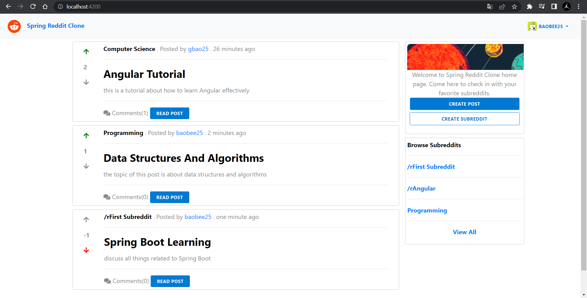
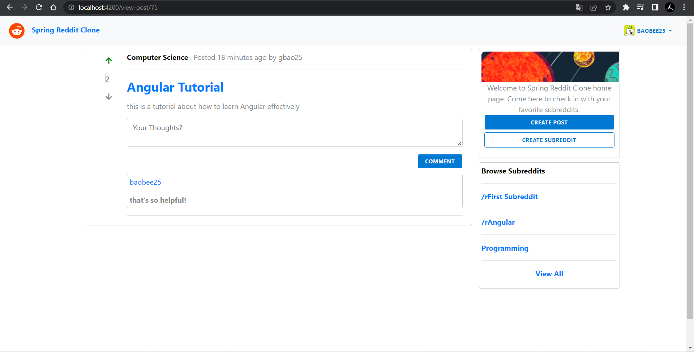
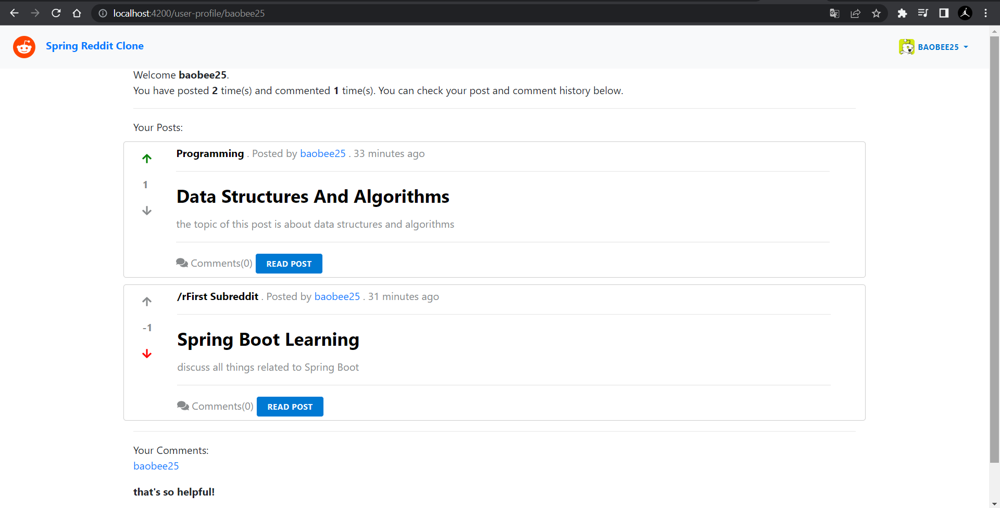

# Reddit-app

### A social media, content rating, and discussion app which is the same as Reddit. This app uses JWT for authentication and authorization.

## Technologies used
```bash
• Spring Boot 
• Spring MVC
• Spring Security with JPA Authentication
• Spring Data JPA with MySQL 
• Angular
• Bootstrap
```

## Source code for Front-end
```bash
https://github.com/BaoNguyen25/Angular-reddit
```

## Screenshots
Home Page


View Post Detail


User Profile


